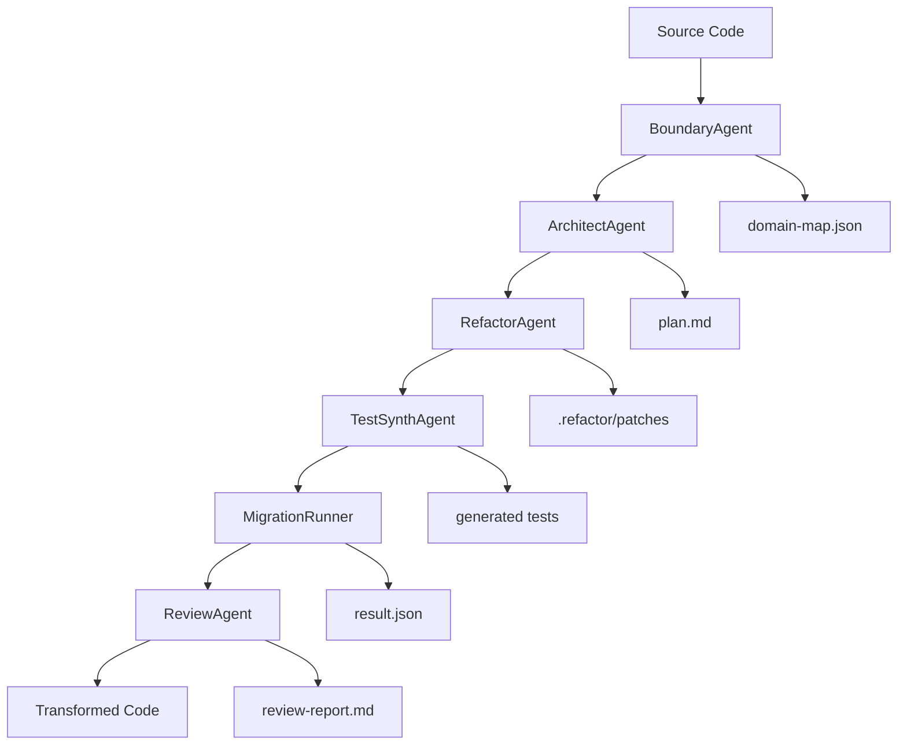

# VibeFlow Architecture Deep Dive

Understanding the engineering behind VibeFlow's AI-powered code transformation pipeline.

## 🏗️ System Overview

VibeFlow implements a **multi-agent autonomous refactoring pipeline** that transforms monolithic codebases into modular architectures through intelligent boundary discovery and AI-powered code generation.



## 🤖 Agent Architecture

### Core Design Principles

1. **Separation of Concerns**: Each agent has a single, well-defined responsibility
2. **Idempotent Operations**: Agents can be re-run safely without side effects
3. **Artifact-Based Communication**: Agents communicate through standardized file artifacts
4. **Fail-Safe Design**: Each agent validates inputs and provides meaningful error recovery
5. **Observable Execution**: All operations generate detailed logs and metrics

### Agent Detailed Breakdown

#### 1. BoundaryAgent (`enhanced-boundary-agent.ts`)

**Purpose**: Discovers logical module boundaries using ML algorithms and AST analysis

**Input**: Source code directory
**Output**: `domain-map.json` with discovered boundaries

**Technology Stack**:
- **AST Parsing**: TypeScript Compiler API, Go AST parser
- **ML Algorithms**: K-means clustering, semantic similarity analysis
- **Dependency Analysis**: Import/export graph analysis
- **Pattern Recognition**: Domain-specific keyword extraction

**Algorithm**:
```typescript
1. Parse all source files → AST representations
2. Extract semantic features:
   - Function/class names and signatures
   - Import/export relationships  
   - Comment analysis for domain terminology
   - Database entity references
3. Apply ML clustering:
   - Feature vectorization using TF-IDF
   - K-means clustering with elbow method
   - Semantic similarity scoring
4. Validate boundaries:
   - Check for circular dependencies
   - Ensure high cohesion within boundaries
   - Validate loose coupling between boundaries
5. Generate confidence metrics and recommendations
```

**Key Features**:
- **Confidence Scoring**: Each boundary includes confidence percentage
- **Hybrid Discovery**: Combines automated discovery with manual overrides
- **Database Alignment**: Validates boundaries against database schema
- **Recommendation Engine**: Suggests improvements and optimizations

#### 2. ArchitectAgent (`architect-agent.ts`)

**Purpose**: Creates detailed architectural plans following Clean Architecture principles

**Input**: `domain-map.json` from BoundaryAgent
**Output**: `plan.md` with refactoring strategy

**Architecture Patterns Supported**:
- **Clean Architecture**: Domain → UseCase → Infrastructure → Handler
- **Hexagonal Architecture**: Core → Ports → Adapters
- **Domain-Driven Design**: Aggregate → Entity → Value Object → Repository
- **Layered Architecture**: Presentation → Business → Data → Integration

**Planning Algorithm**:
```typescript
1. Analyze discovered boundaries
2. Map to architectural layers:
   - Domain: Business entities and rules
   - UseCase: Application-specific business logic
   - Infrastructure: External dependencies (DB, APIs)
   - Handler: Interface adapters (HTTP, gRPC)
3. Generate dependency injection patterns
4. Plan interface definitions and contracts
5. Design test strategies for each layer
6. Create migration sequences with rollback plans
```

#### 3. RefactorAgent (`refactor-agent.ts` + `hybrid-refactor-agent.ts`)

**Purpose**: Executes actual code transformation using AI + templates

**Dual-Mode Operation**:
- **Template Mode**: High-quality pattern-based generation
- **AI Mode**: Claude Code SDK for intelligent transformation
- **Hybrid Mode**: Templates for structure, AI for enhancement

**Transformation Pipeline**:
```typescript
1. Load architectural plan and boundaries
2. For each source file:
   a. Analyze existing code structure
   b. Determine target module assignment
   c. Generate Clean Architecture layers:
      - Extract domain entities
      - Create use case services  
      - Generate repository interfaces
      - Build HTTP handlers
   d. Apply AI enhancement (if enabled):
      - Business logic preservation
      - Error handling improvement
      - Performance optimization
3. Generate comprehensive test suites
4. Validate all generated code compiles
5. Create migration patches
```

**AI Integration**:
```typescript
// Claude Code SDK integration
const integration = new ClaudeCodeIntegration({
  projectRoot: this.projectRoot,
  maxTurns: 3,
  model: 'claude-3-sonnet'
});

const enhanced = await integration.enhanceCode(templateCode, {
  preserveBusinessLogic: true,
  optimizePerformance: true,
  addErrorHandling: true
});
```

#### 4. TestSynthAgent (`test-synth-agent.ts`)

**Purpose**: Generates comprehensive test suites for refactored code

**Test Generation Strategy**:
- **Unit Tests**: For domain entities and use cases
- **Integration Tests**: For repository implementations  
- **Handler Tests**: For HTTP/gRPC endpoints
- **Contract Tests**: For interface compliance

**Coverage Targets**:
- Domain Layer: 95%+ coverage
- Use Case Layer: 90%+ coverage  
- Infrastructure Layer: 80%+ coverage
- Handler Layer: 85%+ coverage

**Test Patterns**:
```go
// Generated domain test example
func TestUser_Validate(t *testing.T) {
    tests := []struct {
        name    string
        user    *domain.User
        wantErr bool
    }{
        {"valid user", domain.NewUser(), false},
        {"empty ID", &domain.User{}, true},
    }
    
    for _, tt := range tests {
        t.Run(tt.name, func(t *testing.T) {
            err := tt.user.Validate()
            if (err != nil) != tt.wantErr {
                t.Errorf("Validate() error = %v, wantErr %v", err, tt.wantErr)
            }
        })
    }
}
```

#### 5. MigrationRunner (`migration-runner.ts`)

**Purpose**: Safely applies transformations with rollback capabilities

**Safety Mechanisms**:
- **Atomic Operations**: All-or-nothing file modifications
- **Backup Management**: Automatic backup before any changes
- **Validation Pipeline**: Compile and test validation before commit
- **Rollback System**: One-click restoration on failure

**Migration Process**:
```typescript
1. Create timestamped backup of all modified files
2. Apply patches in dependency order:
   - Domain entities first
   - Use cases second  
   - Infrastructure third
   - Handlers last
3. Run validation after each layer:
   - Syntax validation
   - Compilation check
   - Test execution
4. On success: Clean up temporary files
5. On failure: Automatic rollback to backup
```

#### 6. ReviewAgent (`review-agent.ts`)

**Purpose**: Analyzes transformation quality and provides auto-merge decisions

**Quality Metrics**:
- **Maintainability Index**: Code complexity and readability
- **Test Coverage**: Percentage of code covered by tests
- **Dependency Metrics**: Coupling and cohesion analysis
- **Performance Impact**: Estimated performance changes

**Auto-Merge Criteria**:
```typescript
const shouldAutoMerge = 
  compilation.success &&
  tests.allPassed &&
  coverage.percentage >= 80 &&
  maintainability.index >= 70 &&
  performance.regressionRisk < 0.1;
```

## 🔄 Workflow Orchestration

### Auto-Refactor Workflow (`auto-refactor-workflow.ts`)

The complete automation pipeline that coordinates all agents:

```typescript
export async function executeAutoRefactor(
  projectPath: string, 
  applyChanges: boolean = false
): Promise<AutoRefactorResult> {
  
  // Step 1: Boundary Discovery
  const boundaryAgent = new EnhancedBoundaryAgent(projectPath);
  const boundaries = await boundaryAgent.analyzeBoundaries();
  
  // Step 2: Architecture Planning  
  const architectAgent = new ArchitectAgent(projectPath);
  const plan = await architectAgent.generateArchitecturalPlan(boundaries.outputPath);
  
  // Step 3: Code Transformation
  const refactorAgent = new RefactorAgent(projectPath);
  const refactorResult = await refactorAgent.executeRefactoring(
    boundaries.domainMap.boundaries, 
    applyChanges
  );
  
  // Step 4: Test Generation
  const testAgent = new TestSynthAgent(projectPath);
  const testResult = await testAgent.synthesizeTests(
    applyChanges ? 'internal' : 'simulation'
  );
  
  // Step 5: Quality Validation
  const validation = await runQualityValidation(projectPath, applyChanges);
  
  // Step 6: Review and Decision
  const reviewAgent = new ReviewAgent(projectPath);
  const review = await reviewAgent.reviewChanges('auto-refactor-results');
  
  return {
    boundaries: boundaries.domainMap.boundaries,
    refactorResult,
    testResult,
    validation
  };
}
```

## 🧠 AI Integration Architecture

### Claude Code SDK Integration (`claude-code-integration.ts`)

**Authentication**: OAuth-based (no API keys required)
**Model**: Claude-3 Sonnet for optimal cost/performance
**Usage Pattern**: Strategic AI enhancement, not wholesale generation

```typescript
export class ClaudeCodeIntegration {
  async enhanceCode(
    templateCode: string, 
    context: EnhancementContext
  ): Promise<string> {
    
    const prompt = this.buildEnhancementPrompt(templateCode, context);
    
    const result = await this.client.query({
      prompt,
      maxTokens: 2000,
      temperature: 0.1  // Low temperature for consistent code
    });
    
    return this.validateAndSanitize(result);
  }
}
```

### Hybrid Strategy

**Cost Optimization**:
- Templates handle structural generation (fast, free)
- AI enhances business logic and error handling (smart, targeted)
- Automatic fallback ensures 100% reliability

**Quality Assurance**:
- All AI-generated code validated through compilation
- Template fallback maintains consistent quality floor
- Human-reviewable diffs for transparency

## 📊 Type System & Data Flow

### Core Type Definitions (`types/refactor.ts`)

```typescript
export interface RefactoredFile {
  refactored_files: {
    path: string;
    content: string;
    description: string;
  }[];
  interfaces: {
    name: string;
    path: string;
    content: string;
  }[];
  tests: {
    path: string;
    content: string;
  }[];
}

export interface RefactorResult {
  applied_patches: string[];
  failed_patches: string[];
  generated_files: string[];
  compilation_result: CompileResult;
  test_result: TestResult;
  metrics: QualityMetrics;
}
```

### Configuration System (`types/config.ts`)

```typescript
export interface VibeFlowConfig {
  architecture: {
    pattern: 'clean-architecture' | 'hexagonal' | 'layered';
    language: 'go' | 'typescript' | 'python';
    layers: string[];
  };
  ai: {
    enabled: boolean;
    fallback_to_templates: boolean;
    max_cost_per_run: number;
  };
  boundaries?: DomainBoundary[];
  cost_limits: CostLimits;
}
```

## 🛡️ Error Handling & Recovery

### Graceful Degradation Strategy

1. **AI Failure**: Automatic fallback to template mode
2. **Compilation Failure**: Rollback to previous state
3. **Test Failure**: Partial rollback of failing components  
4. **Network Issues**: Offline template-only operation
5. **Cost Limits**: Graceful stopping with partial results

### Error Classification

```typescript
export enum ErrorSeverity {
  WARNING = 'warning',    // Continue with fallback
  ERROR = 'error',        // Rollback current operation  
  FATAL = 'fatal'         // Abort entire workflow
}

export interface VibeFlowError {
  code: string;
  message: string;
  severity: ErrorSeverity;
  recovery?: RecoveryAction;
  context?: ErrorContext;
}
```

## 🔍 Observability & Monitoring

### Logging Architecture

- **Structured Logging**: JSON format for programmatic analysis
- **Context Preservation**: Request IDs track operations across agents
- **Performance Metrics**: Detailed timing for each agent
- **Error Tracking**: Full stack traces with recovery suggestions

### Metrics Collection

```typescript
export interface PerformanceMetrics {
  totalDuration: number;
  agentDurations: Record<string, number>;
  fileProcessingRate: number;
  aiTokenUsage: number;
  costBreakdown: CostBreakdown;
}
```

## 🚀 Performance Optimization

### Parallel Processing (Planned)

- **Concurrent Boundary Analysis**: Process multiple modules simultaneously
- **Parallel Code Generation**: Generate layers independently
- **Async Test Execution**: Run test suites in parallel
- **Batched AI Requests**: Optimize AI usage with intelligent batching

### Caching Strategy

- **Template Cache**: Pre-compiled templates for instant generation
- **AST Cache**: Parsed representations for faster analysis
- **AI Response Cache**: Cache common transformations
- **Boundary Cache**: Reuse discovery results for similar codebases

## 🔮 Future Architecture Enhancements

### Plugin System
- **Custom Agents**: User-defined transformation agents
- **Pattern Library**: Extensible architecture pattern catalog
- **Language Extensions**: Support for additional programming languages

### Distributed Processing
- **Worker Pools**: Scale transformation across multiple machines
- **Cloud Integration**: Leverage cloud compute for large transformations
- **Streaming Results**: Real-time progress and partial results

---

**This architecture enables VibeFlow to deliver consistent, high-quality code transformations while maintaining the flexibility to adapt to diverse codebases and requirements.**