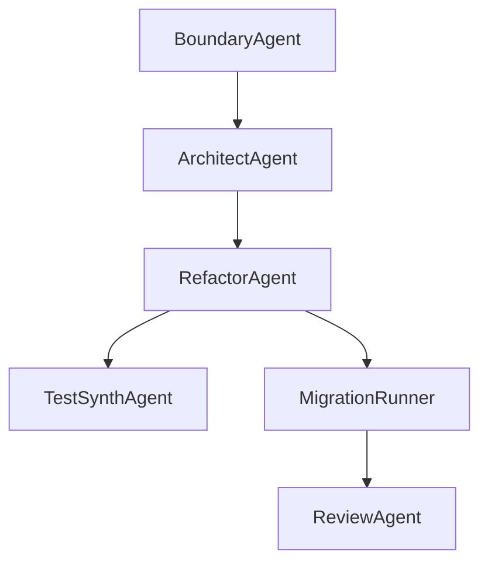
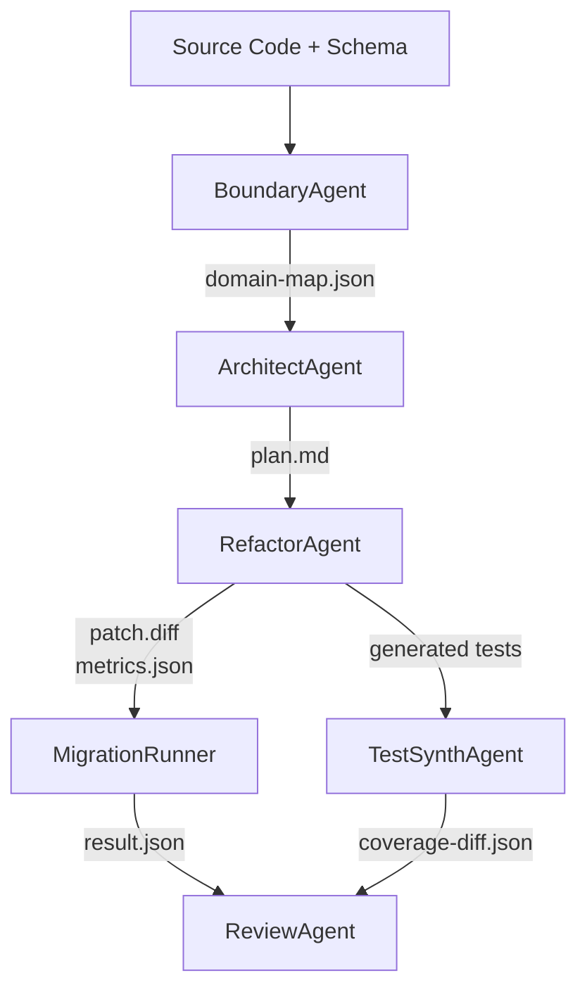

# VibeFlow 総合設計ドキュメント

## 概要

VibeFlow は、モノリシックなコードベースを段階的にモジュラーモノリスへと移行する自動リファクタリングパイプラインです。Mastra ワークフローエンジンと Claude Code / Ollama などの LLM を統合し、コードの構造分析・分割・変換・検証・レビューまでを一貫して自動化します。

---

## エージェント一覧と役割

| エージェント名         | 主な責務 | 入出力ファイル |
|----------------------|---------|----------------|
| **BoundaryAgent**    | コンテキスト境界候補の抽出 | `domain-map.json` |
| **ArchitectAgent**   | 境界統合とパッケージ設計案の作成 | `plan.md` |
| **RefactorAgent**    | `plan.md` に従ったパッチ生成 | `.refactor/`, `metrics.json` |
| **TestSynthAgent**   | テストの再配置・スケルトン生成 | `__generated__/`, `coverage-diff.json` |
| **MigrationRunner**  | パッチ適用 → テスト → メトリクス取得 → ロールバック | `result.json` |
| **ReviewAgent**      | 差分と結果をもとに自動レビュー | PR コメント, 自動マージ判定 |

---

## ワークフロー構成図（Mermaid）



---

## アーティファクト一覧

| ファイル名 | 説明 |
|------------|------|
| `domain-map.json` | コードとDBスキーマから自動抽出された構造情報 |
| `boundary.yaml`   | 手動定義されたユースケース境界 |
| `plan.md`         | パッケージ設計案（Markdown構造） |
| `.refactor/`      | 境界ごとのパッチ・メトリクス出力先 |
| `metrics.json`    | LLMによるパッチ評価（可読性・LOC変化など） |
| `result.json`     | パッチ適用後のビルド・テスト・カバレッジ情報 |
| `coverage-diff.json` | テストカバレッジの差分情報 |

---

## 検証と安全性の担保機構

- 🔁 **循環依存チェック**（ArchitectAgent / ReviewAgent）
- ⛔️ **境界リーク検出**（ArchitectAgent / ReviewAgent）
- 📉 **メトリクス劣化判定**（MigrationRunner）
- 🧪 **テスト網羅率の比較**（TestSynthAgent / ReviewAgent）
- 🔍 **セマンティック差分と責務逸脱チェック**（ReviewAgent）

---

## ロールバック戦略

- Git ベースの安全なパッチ適用 (`git stash`, `git revert`)
- `.rollback.patch` や差分ファイルの保存
- 中間ブランチまたは Dry-run ディレクトリでの先行検証

---

## 今後の拡張候補

- 境界検出における信頼度スコア付与
- UI ダッシュボードによる差分可視化とレビュー
- ReviewAgent におけるポリシープリセット対応（例：security-first, speed-first）

---

## 詳細構成図（データフローと成果物の流れ）



- 各エージェントは専用成果物を出力・次工程に渡すことで独立性を確保しています。
- ReviewAgent は `result.json`, `coverage-diff.json`, `diff`, `domain-map.json` を統合的に利用し、セキュリティや品質ゲートを検査します。

---

## 成果物スキーマ集（簡易仕様）

### `domain-map.json`

```jsonc
{
  "contexts": {
    "User": {
      "modules": ["src/user", "src/account"],
      "entities": ["User", "Account"],
      "relations": ["User -> Account"]
    }
  },
  "meta": {
    "generatedAt": "ISO8601 string",
    "sourceHash": "sha256"
  }
}
```

### `plan.md`（章立て）

- Executive Summary
- Context & Domain Overview
- Proposed Package Structure
- Dependency Policies
- Migration Strategy
- Appendix

### `metrics.json`

```jsonc
{
  "readabilityScore": 0.85,
  "locReduced": 124,
  "circularDependenciesRemoved": 3,
  "status": "valid" // or "invalid_patch"
}
```

### `result.json`

```jsonc
{
  "status": "success",
  "build": { "success": true },
  "test": { "success": true },
  "metrics": {
    "before": { "coverage": 72.5 },
    "after": { "coverage": 81.2 }
  }
}
```

### `coverage-diff.json`

```jsonc
{
  "boundary": "User",
  "coverageBefore": 72.5,
  "coverageAfter": 81.2,
  "regression": false
}
```

---
