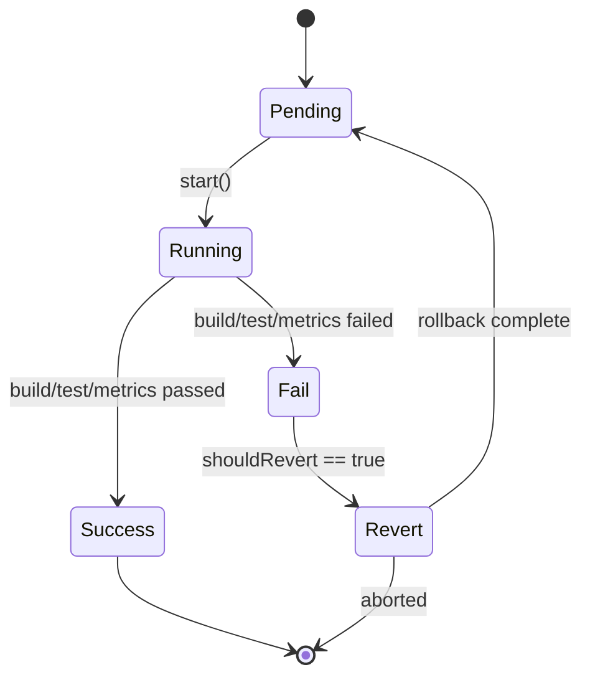

# MigrationRunner 設計ドキュメント

VibeFlow における自動マイグレーション適用・検証の中核機構である MigrationRunner の設計を示します。パッチの適用からロールバックまでを一貫して扱う責務を担います。

---

## 1. ステートマシン図（Mermaid）



- **Pending**: パッチ適用前
- **Running**: ビルド・テスト・メトリクス収集中
- **Success**: 成功状態。マイグレーションが確定。
- **Fail**: テスト失敗・メトリクス劣化など
- **Revert**: 自動ロールバック中

---

## 2. ツールチェーン抽象化方針

Go / TypeScript / Python 各言語のビルド・テスト系コマンドを統一的に扱うため、以下のインターフェースを設けます。

### ToolchainAdapter インターフェース

```typescript
interface ToolchainAdapter {
  name: string;

  // Apply patch or prepare environment
  applyPatch(patchPath: string): Promise<void>;

  // Build project
  build(): Promise<BuildResult>;

  // Run test suites
  test(): Promise<TestResult>;

  // Collect performance metrics
  collectMetrics(): Promise<Metrics>;

  // Rollback patch
  revert(): Promise<void>;
}
```

#### 実装例（抽象）

- GoToolchainAdapter
- TSToolchainAdapter
- PythonToolchainAdapter

それぞれ `go build`, `tsc`, `pytest` などに対応。

---

## 3. ロールバック方針

マイグレーション失敗時のロールバック戦略は以下の通りです。

**優先手順:**

1. `git stash -u && git apply patch.diff` を採用（ステートフルな変更の検証が前提）
2. 失敗時に `git checkout . && git stash pop` または `git revert` を自動実行
3. `patch.diff` の差分が不正な場合（conflict 等）、Revert ステートで手動復旧を促すログ出力

**ロールバック実装内訳:**

- `patch.diff` 適用前に `git rev-parse HEAD` を保存
- 失敗時に `git reset --hard <保存したHEAD>` を試行
- ファイル単位での変更追跡を `result.json` に記録

---

## 4. result.json スキーマ設計

```json
{
  "id": "2025-06-20T15:00:00Z",
  "patchFile": "patches/feature-x.diff",
  "toolchain": "go",
  "status": "fail", // pending | running | success | fail | reverted
  "build": {
    "success": true,
    "log": "..."
  },
  "test": {
    "success": false,
    "log": "test failure at x_spec.ts"
  },
  "metrics": {
    "before": {
      "testCoverage": 84.1,
      "latencyMs": 320
    },
    "after": {
      "testCoverage": 80.2,
      "latencyMs": 470
    },
    "regressionDetected": true
  },
  "revert": {
    "executed": true,
    "log": "Reverted to HEAD abc1234"
  }
}
```

---

## 補足：設計判断と利点

### モチベーション

- MigrationRunner は単体での再試行や並列実行を許容するため、状態管理は明示的なステートマシンで制御
- 各言語対応を抽象化することで、LLM 由来のコード変更を安全に検証可能

### 代替案検討

- `result.json` に加えて、`result.yaml` による人間可読性の強化も検討可
- Revert は `git worktree` によるサンドボックス化でも代替可能（性能重視時）

---

## 6. TDD 向けテストケース一覧

### 🎯 ユニットテスト

| 対象モジュール           | テスト項目                                                                |
| ------------------------ | ------------------------------------------------------------------------- |
| `ToolchainAdapter` 実装  | 各言語（Go, TS, Py）の `build`, `test`, `collectMetrics` の成功・失敗分岐 |
| `PatchApplier`           | `applyPatch` 処理の例外・再実行パターン、patch.diff の存在チェック        |
| `RollbackManager`        | HEAD 保存・リセット処理、`stash pop` 後の復元整合性                       |
| `ResultWriter`           | `result.json` の構造検証、各セクション（build/test/metrics）の書き分け    |
| `StateMachineController` | ステート遷移の正当性、Fail → Revert → Pending の分岐処理                  |

### 🔁 統合テスト

- パッチ適用 → ビルド失敗 → ロールバックの一連の流れが `result.json` に正しく記録されるか
- `metrics.regressionDetected` が true の場合に `Fail` 扱いされるか
- `ToolchainAdapter` が mock で切り替え可能であるか（DI 設計の確認）

### 📎 モック戦略

- Git 操作は `simple-git` 等を抽象化し、dry-run テストを行う
- `fs` 書き込みは tempdir に redirect し、`result.json` の内容をスナップショット比較

---
