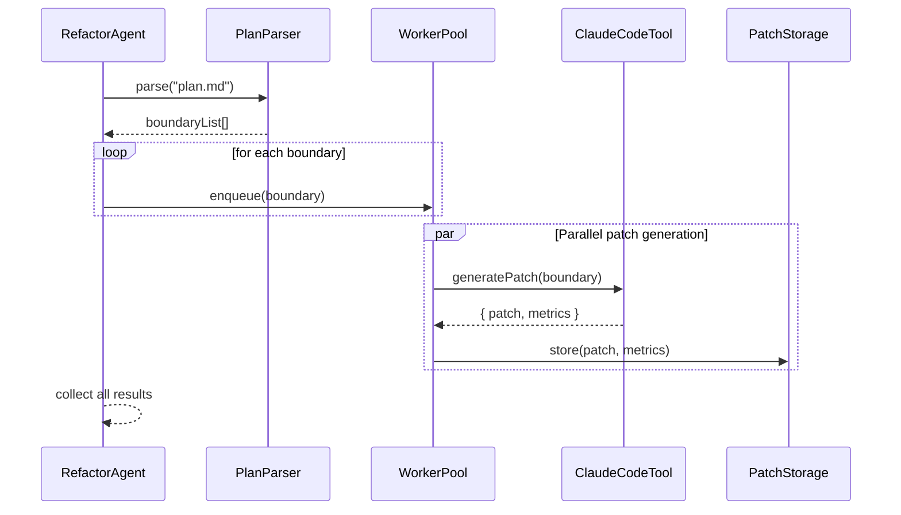

# RefactorAgent 設計ドキュメント

## 1. 責務定義 & シーケンス図

### ✅ 責務定義（Responsibilities）

| 項目                   | 内容                                                                                                                                                                                             |
| ---------------------- | ------------------------------------------------------------------------------------------------------------------------------------------------------------------------------------------------ |
| 入力                   | `plan.md`（ArchitectAgent によって生成された境界情報）                                                                                                                                           |
| 主な処理               | - `plan.md` に基づき対象境界を抽出<br>- 各境界単位で VibeFlow Refactor Tool（Claude Code SDK または Ollama）を呼び出し<br>- パッチファイルを生成し保存<br>- 成功・失敗ログおよびメトリクスを収集 |
| 不変条件（Invariants） | - `plan.md` に記載の境界単位で必ず isolation されていること<br>- 各パッチは idempotent であること（複数回適用しても結果が同じ）<br>- 1 境界 = 1 patch + 1 metrics.json（≒1 タスク）              |

---

## 📈 シーケンス図（Mermaid）



---

## 2. 並列化戦略（キュー／ワーカー設計）

### 🧩 基本戦略

- ワーカープールモデル（Worker Pool Model）を採用。
- 各ワーカーは「1 境界 = 1 タスク」として非同期に LLM（Claude/Ollama）を呼び出し、`.patch` + `metrics.json` を生成。
- ワーカープールの上限数（例: `MAX_WORKERS=4`）は設定可能で、LLM 側の rate limit や compute resource に応じて調整。

### 🧵 並列処理構成

```js
// Pseudocode: simplified structure

const queue = createTaskQueue({ maxWorkers: 4 });

for (const boundary of parsedPlan.boundaries) {
  queue.add(() => refactorBoundary(boundary));
}

await queue.runAll();

// refactorBoundary() は内部で Claude Code SDK / Ollama CLI を叩き、成果物を出力。
// タスク失敗時は retry（詳細は後述）を考慮。
```

---

## 3. 出力 artefacts 定義

### 📁 出力ディレクトリ構造

```
.refactor/
  boundaryA/
  patch.diff
  metrics.json
  log.txt
  boundaryB/
  ...
  summary.json
```

### 🗂️ artefact 詳細

| ファイル名   | 説明                                                                    |
| ------------ | ----------------------------------------------------------------------- |
| patch.diff   | git apply 互換の patch ファイル。Claude / Ollama によるコード修正結果。 |
| metrics.json | LLM による自動評価（可読性向上度、循環参照除去、有効 LOC 削減など）     |
| log.txt      | Claude との全対話ログや LLM 呼び出しパラメータ（debug 用途）            |
| summary.json | 全境界パッチの統合メトリクス。MigrationRunner 等で使用。                |

---

## 4. 失敗時リトライ指針

### 🎯 リトライ戦略

| 状況                                                   | 対応                                                                   |
| ------------------------------------------------------ | ---------------------------------------------------------------------- |
| Claude / Ollama 側の一時的エラー（RateLimit, Timeout） | 最大 3 回まで指数バックオフで再試行                                    |
| 構文的に不正なパッチ（適用エラー）                     | 自動リトライはせず、metrics.json に `"status": "invalid_patch"` を記録 |
| plan.md に記載ミスあり（例: 境界名未定義）             | 即時 Fail。ArchitectAgent への feedback に使用可能                     |

### ⏱️ リトライ実装例（擬似コード）

```js
async function retryWithBackoff(task, retries = 3) {
  for (let i = 0; i < retries; i++) {
    try {
      return await task();
    } catch (e) {
      if (isTransientError(e)) await wait(2 ** i * 500);
      else throw e;
    }
  }
  throw new Error("Max retries exceeded");
}
```

---

## 5. TDD 向けテストケース一覧

### 🎯 ユニットテスト

| 対象モジュール      | テスト項目                                                             |
| ------------------- | ---------------------------------------------------------------------- |
| `PlanParser`        | `plan.md` の境界抽出精度、不正な構造の検出                             |
| `TaskQueue`         | タスクの並列キュー投入、MAX_WORKERS 超過時の挙動                       |
| `RefactorExecutor`  | LLM 呼び出しと `patch + metrics.json` の取得正常性、失敗時のエラー分類 |
| `PatchStorage`      | ファイル出力の整合性、出力ディレクトリのレイアウト確認                 |
| `SummaryAggregator` | 各 metrics の統合結果が正しいか、欠損がある場合の対応                  |

### 🔁 統合テスト

- `plan.md` を与えて `.refactor/boundaryA/patch.diff` などが正しく生成されるか
- Claude または Ollama の失敗をシミュレートし、リトライが最大 3 回で停止すること
- `summary.json` に全 boundary のメトリクスが揃っているか、失敗した場合に欠損扱いで記録されるか

### 📎 モック戦略

- LLM 呼び出し部分は adapter をモックして出力スナップショットで検証
- `fs` 書き出しは temp ディレクトリに redirect してレイアウトを検証可能に
- `console.log` や内部ログ出力もフックして assertion 対象とする

---

## 補足

- Claude Code SDK を使用する場合、プロンプトテンプレートは `plan.md` に準拠。
- Ollama などローカル LLM を併用する構成の場合は、`modelRouter.ts` を抽象化ポイントとして導入可能。
